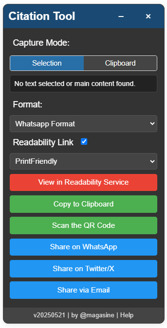
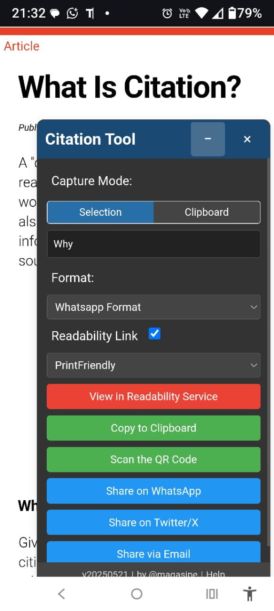

# Citation Tool – Geração e Compartilhamento de Citações e Referências Web
  
> 
## O que é?
> 
> O Citation Tool é um bookmarklet (script executado diretamente do navegador) que oferece uma interface leve e interativa para capturar, formatar e compartilhar trechos de texto de páginas web. Ele é ideal para quem precisa salvar ou compartilhar conteúdos com referências estruturadas e visualmente organizadas — de forma rápida e sem sair da página atual.
> 
## Principais Funcionalidades
> 
### 1) Captura inteligente de conteúdo
> Detecta automaticamente o texto selecionado na página ou, alternativamente, recupera o conteúdo principal do site (ex: artigos, postagens e reportagens). Também permite extrair diretamente do clipboard (área de transferência) do navegador.
> 
### 2) Formatos de citação personalizáveis
> Converte o conteúdo capturado em diversos estilos, adaptados a diferentes contextos:
> - WhatsApp Format (formatação amigável para envio em mensagens),
> - Citação Acadêmica (inclui data de acesso e referência formal),
> - HTML e Markdown (ideal para blogs, wikis e sistemas de documentação),
> - Texto simples (plain text),
> - Twitter/X (respeita limite de caracteres e formato citacional).
> 
### 3) Visualização e edição interativa
> - Exibe uma prévia do conteúdo formatado antes da cópia ou do compartilhamento, com opção de ajustes em tempo real.
> 
### 4) Integração com serviços de leitura facilitada
> - Gera links diretos para serviços como PrintFriendly e Archive.is, permitindo compartilhar versões mais limpas e acessíveis da página original.
> 
### 5) Coleção múltipla via clipboard
> - Modo especial para armazenar múltiplos trechos coletados ao longo da navegação, separando automaticamente com marcadores e organizando tudo em uma única saída citacional.
> 
### 6) Botões de ação rápida
> Com um clique, o usuário pode:
> - Copiar o conteúdo formatado para a área de transferência,
> - Compartilhar diretamente via WhatsApp, Twitter/X, e-mail ou gerar um QR Code com a citação.
> 
### 7) Interface leve, responsiva e com suporte a modo escuro
> - A janela de operação é embutida na própria página, com design adaptável ao tema do sistema e totalmente removível após o uso.

